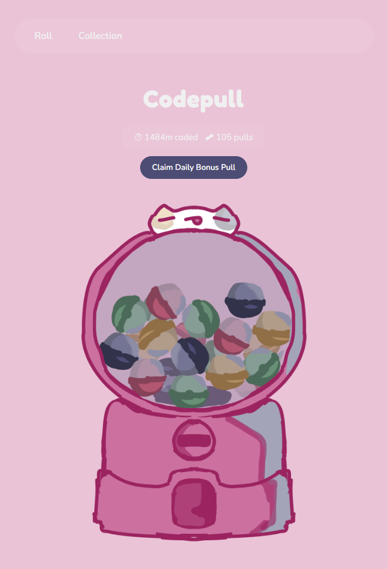
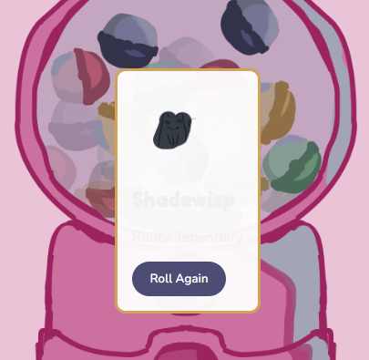
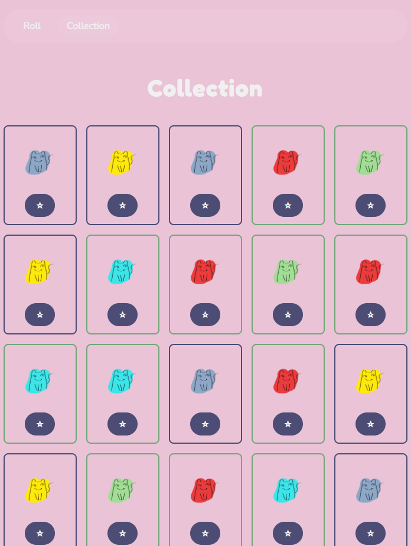
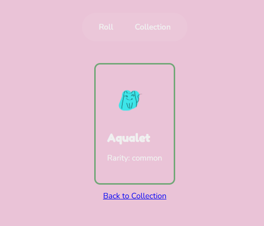

# Description
Codepull is a Web Playable application that uses the time I spent coding and turns it into one gacha pull!

## Tech Stack
- React for UI and state management 
- Vite as build tool and for dev server
- react Router for client side routing
- Hackatime API to fetch my coding time
- CSS for styling
- localStorage to persist pulls spent, collection, daily pull
- Vercel for hosting and deployment

## Motivation
Gamifies the coding process and makes it more fun to actually code!! I was inspired by the hours in hackatime used for purchasing hack club benefits, so I decided to reverse engineer that concept for my project. 

## How it Works
JavaScript framework React.js was used for UI and state management (e.g. keeps track of the different stages of the gachapon capsule roll, which creatures were collected)

React Router enables routing to different pages, such as the creature collection page and individual creature detail pages.

localStorage makes sure data is stored after reload (such as daily pull, creature collection, number of pulls spent)

Hackatime API grabs coding time, and every 10 minutes spent coding is converted into a gacha pull

## Next Steps
Make it possible for other users to bind their hackatime accounts and use this application for themselves.

Update UI and add new creatures (right now they are placeholders)

## AI Usage
Claude code was consulted as a learning aid since this is my first project with JavaScript's react framework.

Copilot was used in conjunction with human writing and claude to write the code used for this project.

Other dependencies can be found in package.json!!
